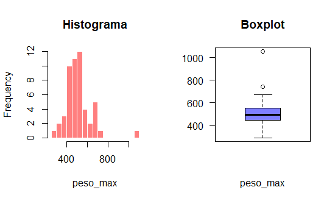
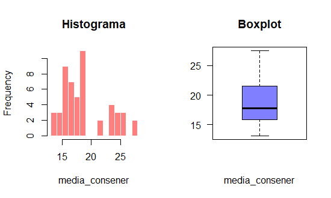
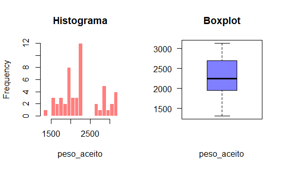
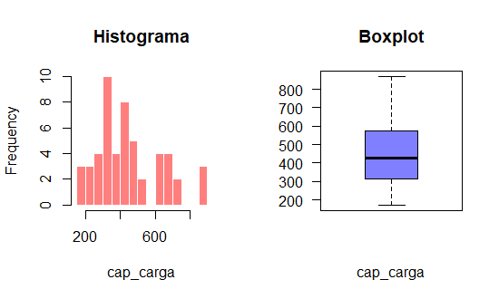

```{r setup, include=FALSE}
# Definindo Diretório de Trabalho
setwd("C:/Users/ALEILSON/Documents/github/R_Proj_feedback1")
getwd()

# Pacotes Necessários
library(readxl)
library(ggplot2)
library(reshape2)
library(corrplot)
library(dplyr)
library(hrbrthemes)
library(randomForest)
library(gmodels)
library(lattice)
library(caret)
library(ggthemes)

# Carregando dataset
dataset <- read_excel("FEV-data-Excel.xlsx")
str(dataset)

# Renomenado Variáveis
names(dataset) <- c("nome","marca","modelo","preco_min","forca_motor","maximo_torque","tipo_freio",
                    "tipo_tracao","capacidade_carga","distancia_max_perco","distancia_eixo","comprimento",
                    "largura","altura","peso_vazio_min","peso_aceito","peso_max","assentos","portas",
                    "tamanho_pneu","vel_max","cap_carga","acel_s","pot_max_carre","media_consener" 
                    ) 
# preco_min [PLN], forca_motor(KM), Maximum torque (newton metros), capacidade_carga (kwh),
# distancia_max_perco ((WLTP) [km]), vel_max [kph], tamanho_pneu [in], cap_carga (L), acel_ 0-100 kph [s]
# pot_max_carre [kW], media_consu-energ [kWh/100 km]
        
```

# Machine Learning em Logística Prevendo o Consumo de Energia de Carros Elétricos

Este Projeto buscou oferecer insight para uma empresa de transporte que deseja migrar sua frota de carros elétricos objetivando a redução de custos.

Com esse objetivo a empresa gostaria de prever o consumo de energia de carros elétricos com base em diversos fatores de utilização dos veículos e características dos veículos.

Para atingir o objetivo dessa pesquisa utilizaremos um conjunto de dados com informações de veículos elétricos adquiridos na Polônia a partir de 2 de novembro de 2020.

## Análise Exploratória

```{r echo = FALSE, results = "hide"}
# Verificando se Existe Valores NA no dataset
any(is.na(dataset))
sum(is.na(dataset)) # Foram detectados 30 valores NA
colSums(is.na(dataset))

# Substituindo valores NA das variáveis num por média
cols <- c("peso_max", "media_consener", "peso_aceito",
          "cap_carga", "acel_s")
dataset[cols] <- lapply(dataset[cols], function(x) {
  meanx <- mean(x, na.rm = TRUE)
  x[is.na(x)] <- meanx
  return(x)
})

# Removendo valor NA de Var categórica
dataset <- na.omit(dataset)
sum(is.na(dataset))
```

Ao verificar se existiam valores *NA* no conjunto de dados, foram detectados o total de 30 valores *NA*. Ao observar isto tomei a decisão de substituir os valores *NA* das variáveis numéricas por suas respectivas médias, e, a única observação com valor *NA* encontrado numa variável categórica decidi por remove-la do dataset.

```{r echo = FALSE, results = "hide"}
# Selecionado variáveis categóricas para Subset.
var_cat <- c("nome","marca","modelo","tipo_freio","tipo_tracao")

# subset variáveis categóricas
subset_cat <- dataset %>% 
  select(all_of(var_cat))

## table de cont - freio e tração
model_table <- table(subset_cat$tipo_freio, subset_cat$tipo_tracao)
model_table <- prop.table(model_table) * 100
a <- round(model_table, digits = 1)
```

### Variáveis Catégoricas

A tabela a seguir traz informações dos tipos de freios e trações dos carros elétricos.

```{r echo = FALSE}
a
```

Analisando essa tabela acima é possível observar que aproximadamente 40% do carros que apresentam tração frontal possuem discos de freio frontal e traseiro, e aproximadamente 35% dos carros que possuem tração nas quatro rodas, tem freios a discos frontais e traseiros. Das 52 observações cerca de 13,04% possuem freio a disco frontal e tambor traseiro.

\newpage

```{r echo = FALSE, results = "hide"}
## table de cont - marca e freio
model_table1 <- table(subset_cat$marca, subset_cat$tipo_freio)
model_table1 <- prop.table(model_table1) * 100

```

A seguir será apresentado informações dos tipos de freios dos carros elétricos e sua marca.

```{r echo = FALSE}
round(model_table1, digits = 1)
```

Apenas as marcas Volkswagen, Smart, Skoda utilizam o tipo de freio a disco frontal e tambor traseiro. As demais marcas utilizam freios a disco frontal e traseiro. Com relação as variáveis categóricas tomei a decisão de segui apenas com as variáveis marca, tipo de freio e tração. Acredito que o nome do carro e o seu modelo não sejam fundamentais para determinar o consumo médio de energia dos carros elétricos. E Além disso, o modelo tem informações semelhantes a variável nome.

### Engenharia de atributos

O código a seguir buscou atribuir valores numéricos as informações contidas nas variáveis categóricas. Vejamos:

```{r}
# Atribuindo valores numericos as variáveis categoricas.
dataset$tipo_tracao <- as.numeric(as.factor(dataset$tipo_tracao))
dataset$tipo_freio <- as.numeric(as.factor(dataset$tipo_freio))
dataset$marca <- as.numeric(as.factor(dataset$marca))
```

Com isso os informações antes descritas por um nome de freio ou tração especifica foi substituído por um número, a modo de representar a mesma informação.

\newpage

### Variáveis Numéricas

As variáveis a seguir são o vetores númericos disponibilizados no conjunto de dados.

```{r}
var_num <- c ("preco_min","forca_motor","maximo_torque","capacidade_carga",
              "distancia_max_perco","distancia_eixo","comprimento","largura",
              "altura","peso_vazio_min","peso_aceito","peso_max","assentos",
              "portas","tamanho_pneu","vel_max","cap_carga","acel_s",
              "pot_max_carre", "media_consener" 
              )
```

```{r echo = FALSE, results = "hide"}
# subset variáveis numéricas
subset_num <- dataset %>% 
  select(all_of(var_num))
```

O códico a seguir cria plots de histograma e boxplot de algumas variáveis do conjunto de dados. Vejamos:

```{r eval = FALSE}
# plots
col <- c("peso_max", "media_consener", "peso_aceito",
          "cap_carga", "acel_s")
mapply(function(x,col) {
  nf <- layout( matrix(c(1,2), ncol=2) )
  hist(x , breaks=20 , border=F , col=rgb(1,0,0,0.5), main="", xlab=col)
  title(main = "Histograma")
  boxplot(x , col=rgb(0,0,1,0.5) , las=2, xlab=col)
  title(main = "Boxplot")
}, subset_num[col], col)
```

\newpage

### Plot - 1 Peso Maximo

Vejamos algumas estatísticas da variável Peso Máximo.

```{r}
summary(dataset$peso_max)
```

Ao observa o summary da variável fica vemos que o menor peso máximo de uma carro elétrico nesse banco de dados é de 290 kg e o maior peso máximo é de 1056 kg.
Ainda é possível observar que a mediana foi de 495 kg e a média de 513 kg, isso nos sugere que existem valores extremos nos dados que puxam a média para cima.
O plot a seguir apresenta essas informações no formato de histograma e boxplot da variável Peso máximo.

```{r echo = FALSE}

```

1.  Analisando histograma é possível observa que a maior parte das observações estão concentrada em 445 kg e 546 kg. Isto é, o peso máximo dos carros elétricos em sua maioria estão entre esse intervalo.
2.  No boxplot foi possível detectar dois valores com potencial outlier, um sendo superior a 1000 kg e outro próximo a 800 kg. Ainda sobre o boxplot e distribuição dos dados parecem ser igualmente distribuídas no primeiro e terceiro quartil.

\newpage

### Plot - 2 Média de Consumo de Energia

Vejamos algumas estatísticas da variável média de consumo de energia.

```{r}
summary(dataset$media_consener)
```

O valor médio mínimo de consumo energia observado foi de 13.10 kWh/100 km e o valor máximo foi de 27.55 kWh/100 km. Ainda é possível observar que os valores da média e média são muito próximos o que indica que não existe valores extremos nesse vetor.
O plot a seguir apresenta informações no formato de histograma e boxplot da variável Média de Consumo de Energia.

```{r echo = FALSE}

```

1. Ao explorar o histograma de início é observado que a variável media_consener não segue uma destruição normal. Além disso, a maior contagem dos dados está concentrada entre o intervalo de 15 a 21 kWh/100 km. Ou seja, a maioria do carros apresentam um consumo médio de energia de 15 a 21 kWh/100 km.
2. O boxplot dessa variável nos mostra que a maior concentração de dados está no terceiro quartil.

\newpage

### Plot - 3 Peso Aceito

Vejamos algumas estatísticas da Peso aceito.

```{r}
summary(dataset$peso_aceito)
```

Observando a variável peso aceito, vemos que o peso bruto admissível mínimo encontrado nessa dataset foi de 1310 kg e o máximo de 3013 kg.
Também é visto que as medidas de tendência central media e mediana são muito próximas, o que nos dá o indicativo de que não existe outliers nessa variável.
O plot a seguir apresenta informações no formato de histograma e boxplot da variável Peso Aceito.

```{r echo = FALSE}

```

1.  Observando a histograma da variável peso aceito podemos ver que ela não segue uma distribuição normal.
2.  Analisando o boxplot é visto que o terceiro quartil apresentam uma maior concentração de dados em comparação com o primeiro quartil.

\newpage

### Plot - 4 Capacidade de Carga

Vejamos algumas estatísticas capacidade de carga.

```{r}
summary(dataset$cap_carga)
```

Ao observar o resultados é visto que é menor valor observado foi de 171 L e o maior valor de 870 L. A média dessa variável foi de 445 L e a mediana 425 L, como o valor de média é superior ao valor de mediana existe a possibilidade é existir valores extremos.
O plot a seguir apresenta informações no formato de histograma e boxplot da variável capacidade de carga.

```{r echo = FALSE}

```

1.  Essa variável assim como as demais não segue uma destruição normal. Observando o histograma vemos que a maior contagem dos dados está entre o intervalo de 315 L a 558 L. Ou seja, os carro elétricos em sua maioria para esse conjunto de dados tem uma capacidade de carga medida em litros no intervalo de 315 L a 558 L.
2.  Observando o boxplot é possível detectar um pouco de concentração dos dados no terceiro quartil em comparação ao primeiro quartil.

\newpage

### Plot - 5 Aceleração de 0-100 Kph em segundos

Vejamos algumas estatísticas da Aceleração de 0-100 Kph em segundos.

```{r}
summary(dataset$acel_s)
```

Ao analisar a estatísticas da variável **acel_s**, que é medida em segundos, foi visto que o menor tempo observado para atingir 100kph foi de 2.5 segundos e o maior tempo foi de 13.1 segundos. Os valores da média e mediana são muito próximos o que indica que não existe valores extemos nesse vetor.
O plot a seguir apresenta informações no formato de histograma e boxplot da variável capacidade de carga.

```{r echo = FALSE}
knitr::include_graphics("acel_s.png")
```

1.  De acordo com o histograma a grande maioria dos carros desse conjunto de dados apresentam uma aceleração de 0 a 100 kph medido em segundos de 7 a 10 s. Isto é, o maioria dos carros desse dataset levam para atingir os 100 kph demora cerca de 7 a 10 segundos.
2.  Ao observar o boxplot é possível detectar que o primeiro quartil apresenta um maior volume de dados se comparado com o terceiro quartil.

\newpage

## Análise estatística bivariada

A análise estatística bivariada permite fazer uma análise entre duas variáveis de modo a entender o comportamento entre a variáveis estudadas.

### plot 1

Vejamos no Plot a seguir o relacionamento entra a variável **peso vazio mínimo** e **peso aceito**.

```{r echo = FALSE}
# plot 1
  ggplot(subset_num) +
  aes(peso_vazio_min, peso_aceito) +
  geom_point() +
  ggtitle("Peso vazio min x Peso Aceito") +
  xlab("Peso Vazio min") + 
  ylab("Peso Aceito") + 
  theme_tufte()
```

Como podemos ver no gráfico acima as variáveis **peso vazio mínimo** e **peso aceito** apresentam alta correlação positiva, isto é, à medida que **peso aceito** aumenta o **peso vazio mínimo** também aumenta. Agora veremos o resultado do cálculo de correlação entre essas variáveis para confirmar o que foi visto no gráfico.

```{r}
cor(subset_num$peso_vazio_min, subset_num$peso_aceito)
```

Sabemos que a correlação é uma medida estatística entre -1 e 1, quanto mais próximo de -1 maior é a correlação negativa entre a variáveis e quanto mais próximo de 1 maior é a correlação positiva entre as variáveis. Nesse exemplo a variáveis **peso vazio mínimo** e **peso aceito** apresentaram uma correlação de aproximadamente 0.90, isto significa que ela apresentam uma forte correlação positiva. Isto posto, essa variáveis independentes podem apresentar problemas de multicolinearidade ao modelo de regressão, por isso, mais afrente tomarei a decisão de escolher a melhor variável para o modelo proposto.

\newpage

### Plot 2

O gráfico a seguir demonstra a relação entre as variáveis **Aceleração de 0-100 kph (s)** e **Máximo Torque**. É importante saber que Torque é uma medida de força, é uma grandeza vetorial associada às forças que produzem rotação em um corpo.

```{r echo = FALSE}
  ggplot(subset_num) +
  aes(acel_s, maximo_torque) +
  geom_point() +
  ggtitle("Aceleração 0-100 kph (s) x Maximo Torque") +
  xlab("Aceleração (s)") + 
  ylab("Torque (L)") + 
  theme_tufte()
```

É visto no Plot 2 que a medida que o **Máximo Torque** sobe, o tempo medido em segundos para atingir a aceleração de 0 a 100 kph cai. Logo, as variáveis **Aceleração de 0-100 kph (s)** e **Máximo Torque** possível uma correlação negativa. Veremos a seguir o cálculo de correlação estre essas variáveis.

```{r}
cor(subset_num$acel_s, subset_num$maximo_torque)
```

Assim como vimos no plot 2, o cálculo de correlação dessa variáveis nos diz que elas apresentam forte correlação negativa. Esses vetores podem passar informações semelhantes ao modelo e assim ocorrer problemas de multicolinearidade.

\newpage

### Plot 3

O gráfico a seguir traz informações sobre a relação entre as variáveis **velocidade máxima** e **força do motor**.

```{r echo = FALSE}
subset_num %>% 
  ggplot() +
  aes(vel_max, forca_motor) +
  geom_point() +
  labs( title = "Velocidade Máxima x Força do Motor") +
  xlab("Velocidade") + 
  ylab("Força do Motor") + 
  theme_tufte()
```

É observado no gráfico que esses vetores possuem uma relação positiva, isto é, a medida que a **força do motor** aumenta a **velocidade máxima** do carro também aumenta. Vejamos o cálculo de correlação para verificar a força da relação dessas duas variáveis.

```{r}
cor(subset_num$vel_max, subset_num$forca_motor)
```

O cálculo estatístico obtido entre essas duas variáveis foi de aproximadamente 0.93, isso significa que elas possuem uma forte correlação positiva.

\newpage

### Plot 4

A seguir será apresentado um heatmap de correlação entre as variáveis numéricas disponível nesse banco de dados.

```{r echo = FALSE, results = "hide"}
var_num1 <- c("forca_motor","maximo_torque","vel_max","acel_s","peso_max",
              "peso_aceito","peso_vazio_min","cap_carga",
              "distancia_max_perco","distancia_eixo","comprimento")

matriz <- dataset  %>%
  select(all_of(var_num1))

matrizcorr <- (cor(matriz))
matriz_melt <- melt(matrizcorr)
```

```{r echo = FALSE}
ggplot(matriz_melt, aes(Var2, Var1, fill = value)) + 
  geom_tile() + 
  geom_text(aes(label = round(value, 2)), color = "black", size = 3) +
  scale_fill_gradient2(low = "white", high = "red", midpoint = 0) +
  theme(axis.text.x = element_text(angle = 45, hjust = 1))

```

Nesse heatmap as variáveis com um tom em vermelho apresentam correlação positiva e as que apresentam um tom mais próximo ao branco tem correlação negativo. Dessa forma, os vetores **vel_max**, **forca_motor** e **maximo_torque** apresentam uma forte correlação positiva entre si, essas variáveis também apresentam um uma forte correlação negativa com **acel_s**.

\newpage

### Feature Selection

Nessa seção vamos selecionar as variáveis com características mais relevantes e informativas para o modelo proposto mais à frente. E ao mesmo tempo reduzir o número de características a serem utilizadas no modelo. Para isso decidi utilizar o modelo **Random Forest** para calcular a importância das variáveis. Vejamos o gráfico a seguir.

```{r echo = FALSE}
# variaveis significantes
df <- dataset %>% select(-c("nome", "modelo"))

vars_df_normalize <- c("marca","preco_min","forca_motor","maximo_torque","tipo_freio",
                       "tipo_tracao","capacidade_carga","distancia_max_perco","distancia_eixo","comprimento",
                       "largura","altura","peso_vazio_min","peso_aceito","peso_max","assentos","portas",
                       "tamanho_pneu","vel_max","cap_carga","acel_s","pot_max_carre" 
) 

# padronização dos dados
df[, vars_df_normalize] <- scale(df[, vars_df_normalize])


modelo <- randomForest(media_consener ~ . ,
                       data = df,
                       ntree = 100, nodesize = 10,
                       importance = TRUE)
```

```{r echo = FALSE}
varImpPlot(modelo)
```

Antes de rodar o modelo Random Forest foi aplicado uma padronização dos dados com a função **scale**. Ao observar o modelo Rf decidi selecionar as 15 variáveis mais importantes de acordo com a métrica MSE do modelo.

```{r}
var_fs <- c ("peso_max","peso_aceito","comprimento","distancia_eixo","cap_carga",
             "vel_max","tamanho_pneu","largura","marca","preco_min","peso_vazio_min",
             "distancia_max_perco","maximo_torque","capacidade_carga","pot_max_carre",
             "media_consener"
              )

# Feature selection
df_fs <- df %>% 
  select(all_of(var_fs))
```

\newpage

## Pré processamento

Aqui iremos dividir os dados em treino e teste e em seguir dar início ao processamento do modelo de regressão.

```{r}
# dividindo dados em treino e teste
set.seed(1998)
indice_treinamento <- createDataPartition(df_fs$peso_max, p = 0.7, list = FALSE)
dados_treinamento <- df_fs[indice_treinamento,]
dados_teste <- df_fs[-indice_treinamento,]
```

## Processamento do Modelo: Regressão Linear Multipla

### Modelo 1
```{r}
# Modelo de Regressão 1
model1 <- lm(media_consener ~ ., data = dados_treinamento)
summary(model1)
```

Observando os resultados obtidos por esse modelo vemos que:

- **Residual standard error** teve um valor baixo de 1.288 o que indica que em termos médio a variabilidade dos erros foram relativamente baixas.

- **Multiple R-squared** obtido nesse modelo foi de 0.9386, isso nos diz que cerca de 93,86% da variação da variável de estudo é explicada pelas variáveis independentes do modelo. O que é considerado um valor alto, ou seja, o modelo tem um alto valor explicativo.

- **p-value** desse modelo vou muito baixo, 1.989e-10. Dito isso, a hipótese nula que diz que as variáveis independentes são irrelevantes para explicação do modelo é rejeitada. Ou seja, temos evidência de que ao menos um variável seja relevantes na explicação da variável target.

Embora esse modelo de regressão linear múltipla tenha apresentado bons parâmetros em termos explicativos. É importante lembrar que esse modelo proposto utilizou-se de um grande número de variáveis e apenas algumas apresentaram um bom nível de significância. Ainda, foi visto anteriormente que algumas das variáveis independentes desse modelo apresentam alta correlação entre si e isso pode ter afetado o modelo com problemas de multicolinearidade e por conseguinte de overfitting.

### Modelo 2 

Como foi visto na análise exploratória algumas variáveis independentes
apresentaram um alta correlação. Agora, irei excluir alguns desses vetores do modelo
com o objetivo de evitar possíveis problemas de multicolinearidade e overfitting.

```{r}
# Modelo de Regressão 2

var2 <- (media_consener ~ peso_max + peso_aceito + capacidade_carga + vel_max +
           distancia_max_perco + pot_max_carre + largura + marca + 
           + tamanho_pneu)

#treino
model2 <- lm(var2, data = dados_treinamento)
summary(model2)
```

\newpage

Dos resultados:

- O **Residual standard error** continuou com valor baixo de 1.343 o que indica que em média de variabilidade dos erros foram relativamente baixas.

- O **Multiple R-squared** obtido no modelo 2 foi de 0.9158, ele nos diz que cerca de 91,58% da variação da variável de estudo é explicada pelas variáveis independentes do modelo. Ainda que esse modelo detinha tido uma perda em seu valor explicativo em comparação com o modelo 1, ele ainda tem uma alto valor explicativo. 

- **p-value** do modelo 2 continuou muito baixo, 3.203e-13. Assim como o modelo anterior, a hipótese nula foi rejeitada. Ou seja, esse modelo apresenta evidências de que ao menos uma variável seja relevantes na explicação da variável dependente.

A retirada de algumas variáveis desse modelo não teve prejuízo significativo na capacidade de explicação da variável dependente. E além disso, essa redução no número de variáveis independentes reduz os custos de reprodução do modelo. Essa redução aumentou o nível se significância de alguns vetores nesse modelo.

### Modelo 3

Com objetivos semelhantes ao modelo anterior tomei a decisão de remover as variáveis marca, largura, peso_max e pot_max_carre. Essas variáveis apresentaram um baixo nível de significância estatística no modelo.

```{r}
# Modelo de Regressão 3

var3 <- (media_consener ~ peso_aceito + vel_max + tamanho_pneu +
           distancia_max_perco + capacidade_carga
)

# Treino
model3 <- lm(var3, data = dados_treinamento)
summary(model3)
```

\newpage

Resultados obtidos modelo 3:

- **Residual standard error** do modelo 3 assim como o outros dois modelos apresentou um valor baixo de 1.334, indicando que em termos médio a variabilidade dos erros foram relativamente baixas.

-  Já o **Multiple R-squared** obtido no modelo 3 foi de 0.9054, nos indicando que cerca de 90,54% da variação o objeto de estudo pode ser explicado pelas variáveis independentes desse modelo. Isso é considerado um alto valor explicativo.

- A **F-statistic** obtida nesse modelo foi consideravelmente alta. O valor F de 63.16 mostra que a variação explicada pelas variáveis independentes do modelo é maior que a variação que não é explicada pelo modelo.

- O **p-value** continuou com um valor baixo de 3.203e-13. Com isso, a hipótese nula que foi rejeitada. Ou seja, nesse modelo temos evidência suficiente de que ao menos uma variável seja relevantes na explicação da variável de dependente.

Esse modelo de regressão linear também apresentou bons parâmetros em termos explicativos da variável dependente. O modelo 3 apresentou de acordo com a estatística F maior potencial de explicabilidade da variável de estudo. É importante ressaltar que nesse modelo as variáveis independentes tiverem um alto valor de significância no modelo.


